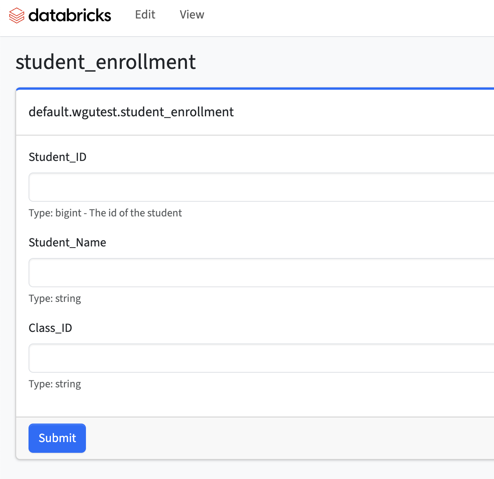
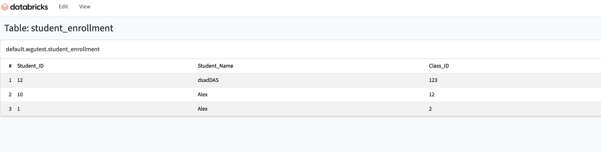

# Databricks App - Delta Data Entry

A simple interface to manually add data to a delta table via a form

## This app is meant for users that requires small input data in delta tables some use cases are:
* Pipelines that requires manual variables to be entered and requires users to change it
* Metadata driven workflows which read data from delta tables to setup can use this app to enter the configuration
* Dashboards that requires manual variables to be entered

### View to edit tables 


### View to visualize tables 


# How to get started
* Install databricks cli and configure your workspace authentication see here: https://docs.databricks.com/en/dev-tools/cli/install.html
* Create your app: ```databricks apps create delta-data-entry```
* Edit the file: ```app.yml```include the full table name that will be edited and the warehouse_id for the warehouse to be used in the backend (it is recommended that the warehouse is serverless)
* Sync the files with the workspace: ```databricks sync --watch . /Workspace/Users/<username>/App/delta-data-entry``` (you can keep this command in a side window if you want to sync continously)
* Deploy: databricks apps deploy slack-bot --source-code-path=/Workspace/Users/<username>/App/delta-data-entry
* Open the url of your app provided in the response of the above command

