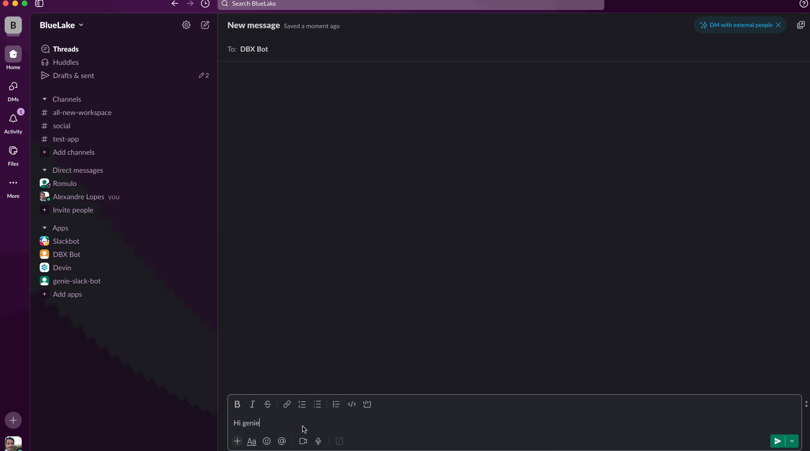
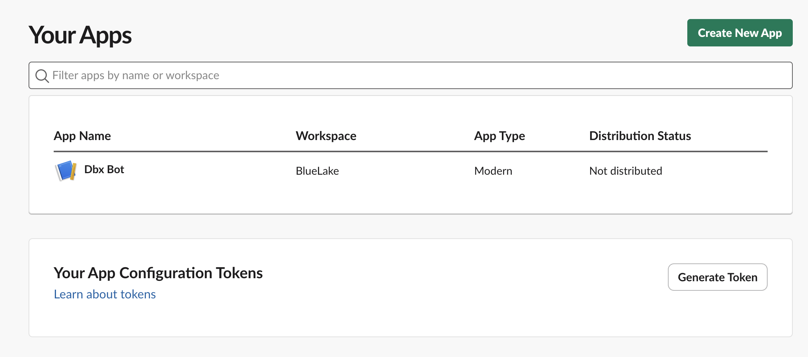
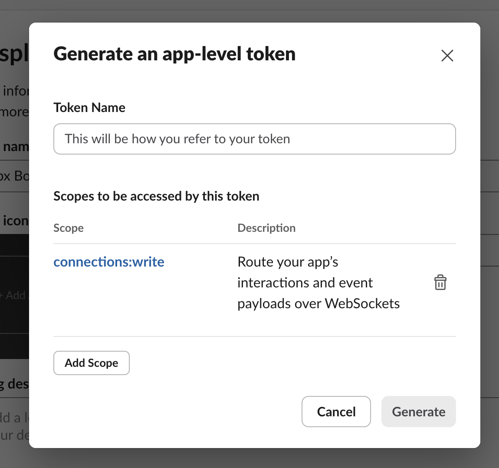
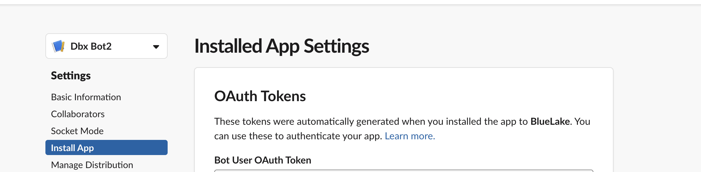

# Genie Slack Bot for Databricks Genie

Genie Slack Bot enables seamless integration between Slack and Databricks Genie, allowing users to interact with Genie directly from Slack for instant data insights, query generation, and workflow automation.



## Features

- Connect Slack conversations to Databricks Genie for real-time data analysis.
- Generate SQL queries and receive results directly in Slack threads.
- Automate workflows and get instant feedback from Genie.
- Secure integration using Databricks secrets.

## Quick Start

1. **Install Databricks CLI**  
   Configure your workspace authentication: [Databricks CLI Install Guide](https://docs.databricks.com/en/dev-tools/cli/install.html)

2. **Create a Slack App**  
   Follow the steps below to set up your Slack integration.

3. **Create the Genie Slack Bot App in Databricks**  
   ```sh
   databricks apps create genie-slack-bot
   ```

4. **Sync the Project Files**  
   ```sh
   databricks sync --watch . /Workspace/Users/<username>/App/genie-slack-bot
   ```
   *(You can keep this command running to sync changes automatically.)*

5. **Configure Secrets**  
   Use the notebook in `/Workspace/Users/<username>/App/genie-slack-bot` to securely store your Slack credentials.  
   Enter the values for the secrets when prompted, then remove them from the widgets for security.

6. **Deploy the App**  
   ```sh
   databricks apps deploy genie-slack-bot --source-code-path=/Workspace/Users/<username>/App/genie-slack-bot
   ```

7. **Start Using Genie in Slack**  
   Find your bot in Slack and start a conversation to interact with Databricks Genie.

## Slack App Setup

1. **Create a Slack Account & Workspace**  
   If you don’t have one, create a workspace for testing: [Create a Slack Workspace](https://slack.com/help/articles/206845317-Create-a-Slack-workspace)

2. **Create a New Slack App**  
   Go to the Slack apps page and select "Create New App".  
   

   Use the `manifest.yml` file in this project to configure your app.

3. **Generate App-Level Token**  
   In the Basic Information menu, scroll down and generate an App-level token with `connections:write` scope.  
   

   Save this token and use it when creating secrets.

4. **Install the App & Get Bot Token**  
   Install the app in your workspace. After installation, a bot user token will be displayed—save it and use it in the secrets setup.  
   

## Support & Contribution

- Fork and open a pull request to contribute new features.
- Raise issues via GitHub for feature requests.
- Licensed under MIT. Software is provided as-is.
