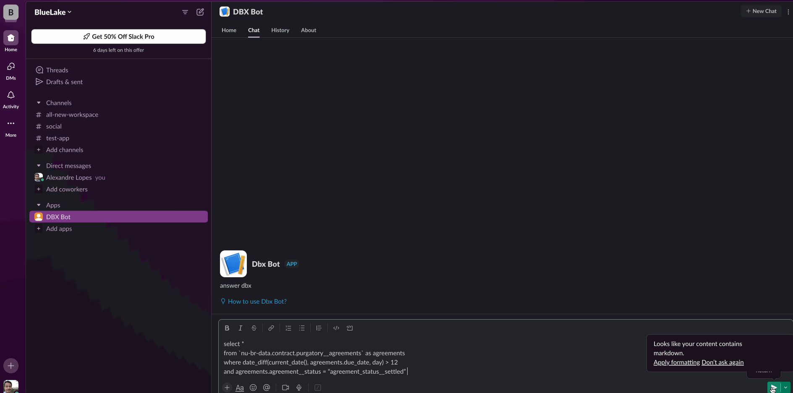

# Databricks App - Slack Bot

# This is a simple customizable slack bot built to run in Databricks Apps Environment


# How to get started
* Install databricks cli and configure your workspace authentication see here: https://docs.databricks.com/en/dev-tools/cli/install.html
* Create a slack app - Steps Below
* Create your app: ```databricks apps create slack-bot```
* Sync the files with the workspace: ```databricks sync --watch . /Workspace/Users/<username>/App/slack-bot``` (you can keep this command in a side window if you want to sync continously)
* Use the notebook under the folder  ```/Workspace/Users/<username>/App/slack-bot``` create secrets and store the slack credentials securely execute the first line after the widgets are created enter the values of the secrets to be stored - make sure these values are removed from the widgets later
* Deploy: databricks apps deploy slack-bot --source-code-path=/Workspace/Users/<username>/App/slack-bot 
* Look for your bot in slack and send a message

# How to create a slack app and get credentials